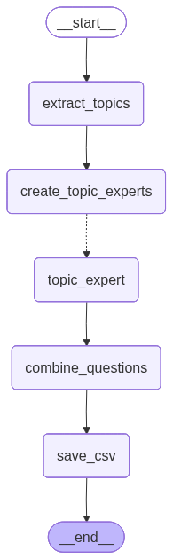

# Course Questions Gen

This project is a small LangGraph workflow for generating course questions through focused graph nodes. The graph creates specialized content experts, fans out question generation work, then combines and formats the results. Prompts are stored as editable Markdown files so the graph behavior can evolve without burying instructions in code.
